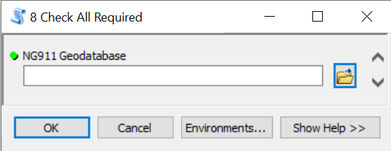
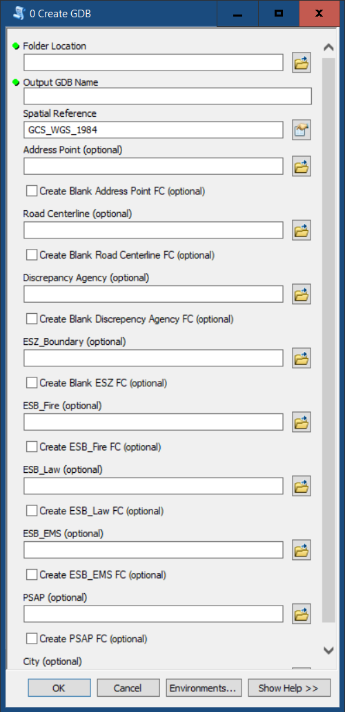
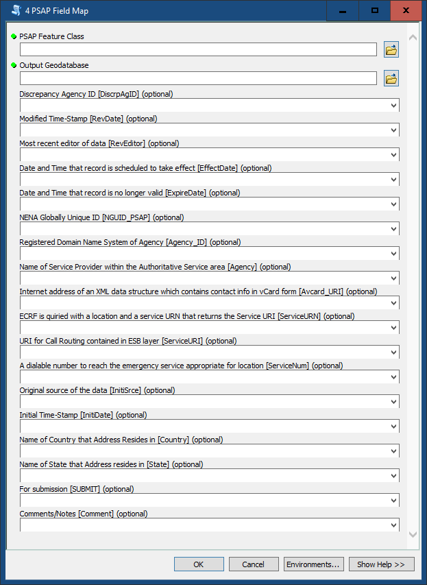

[**Oklahoma NG911 Toolkit**](../README.html) | [Adjustment](Adjustment.html) | [Comparison](Comparison.html) | [Enhancement](Enhancement.html) | [MSAG](MSAG.html) | [Okprep](Okprep.html) | [Submission](Submission.html) | [Validation](Validation.html)

**Supplementary Documentation** | [***Examples***](Examples.html) | [Generate Fishbone Analysis Tool](FishboneAddressVerification.html) | [Topology Rules](Topology.html) | [Change Log](../ChangeLog.html) | [Error Glossary](ErrorGlossary.html)

# Toolset Use Examples

## Toolset Credits
* Emma Baker, Oklahoma Department of Transportation
* Riley Baird, Oklahoma Department of Transportation

##### Last Revised:
June 15, 2022

## Abstract
The possible uses for the Toolset vary based on the current configuration of your data.

### **Dataset is completely standards-compliant**
* In this scenario, the user would first run the Validate All Tool.

* After this, depending on the results, the user may need to alter the data in order to match Oklahoma NG911 Standards. There are some tools that can assist in this process (Adjustment and Enhancement).

### **Dataset is partially standards-compliant**
* In this scenario, the user may want to run the Validate All tool to find out what in the dataset is not standards-compliant. Depending on the results, the user could either begin with the OK Prep tool "0-Create GDB" or the appropriate Field Map tool.
* The Create GDB tool creates a new standards-compliant GDB and the user can selected the appropriate standards-compliant feature classes. If the user would like to create blank standards-compliant feature classes, those options are available. Note: if the submitted feature class is not standards-compliant, a blank feature class is created if the user has selected the appropriate option, otherwise the feature class is not created.

* The Field Map tools create a standards-compliant feature class with the correct field parameters in a user-supplied output GDB and user-supplied field map. The user would then run the Validate All tool again to figure out if the dataset needs further maintenance. There are some tools that can assist in this process (Adjustment and Enhancement).

### **Dataset is not standards-compliant**
* In this scenario, the user would want to create a new standards-compliant GDB with no provided feature classes and the create blank feature class option turned **off**.
* The user would then use the Field Map tools to create the standards-compliant feature classes in the new standards-compliant GDB.
* The user would then run the Validate All tool again to figure out if the dataset needs further maintenance. There are some tools that can assist in this process (Adjustment and Enhancement).

### **No existing dataset**
* In this scenario, the user would want to create a new standards-compliant GDB with the create blank feature class option turned **on**.
* From there, the user would entered the appropriate data into the datasets as needed.

## Support Contact
For issues or questions, please contact Emma Baker or Riley Baird with the Oklahoma Department of Transportation. Email Emma at <ebaker@odot.org> or Riley at <rbaird@odot.org>, and please include in the email which script you were running, any error messages, and a zipped copy of your geodatabase. Change the file extension from `zip` to `piz` so it gets through the email server. If there are further data transfer issues, contact Emma or Riley to make alternative data transfer arrangements.

If you have a domain issue to report, please email Emma Baker at <ebaker@odot.org>. Please indicate what type of domain the issue is with and the values needing corrections.

## Disclaimer
The Oklahoma NG9-1-1 GIS Toolbox is provided by the Oklahoma Geographic Information (GI) Council, Oklahoma 9-1-1 Management Authority, Oklahoma Department of Transportation (ODOT), Oklahoma Office of Geographic Information (OGI) , and associated contributors "as is" and any express or implied warranties, including, but not limited to, the implied warranties of merchantability and fitness for a particular purpose are disclaimed.  In no event shall the Oklahoma GI Council, Oklahoma 9-1-1 Management Authority, ODOT, OGI, or associated contributors be liable for any direct, indirect, incidental, special, exemplary, or consequential damages (including, but not limited to, procurement of substitute goods or services; loss of use, data, or profits; or business interruption) however caused and on any theory of liability, whether in contract, strict liability, or tort (including negligence or otherwise) arising in any way out of the use of this software, even if advised of the possibility of such damage.
