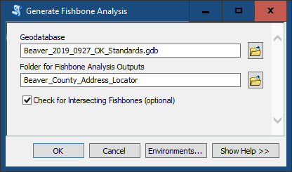
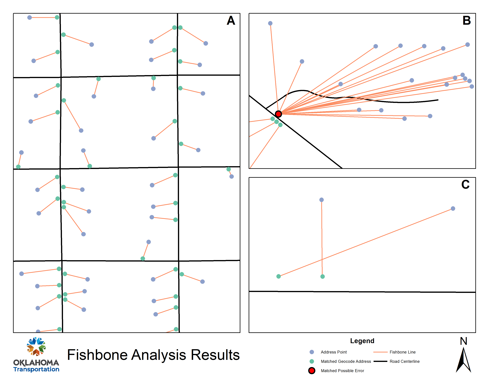
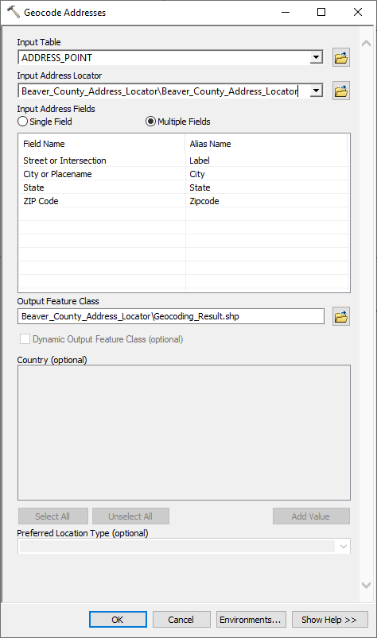
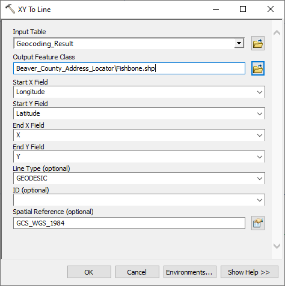
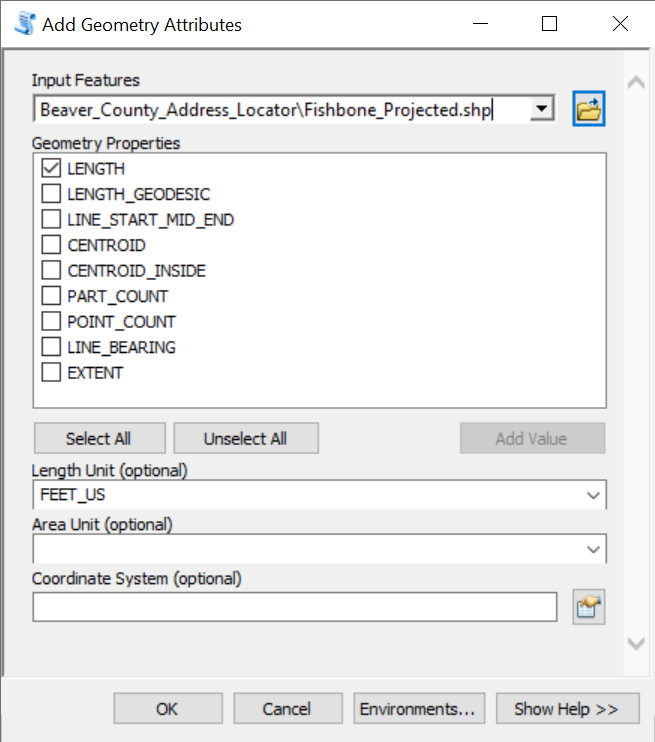
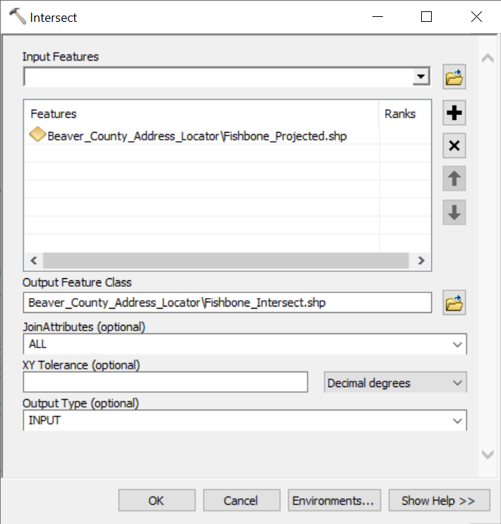
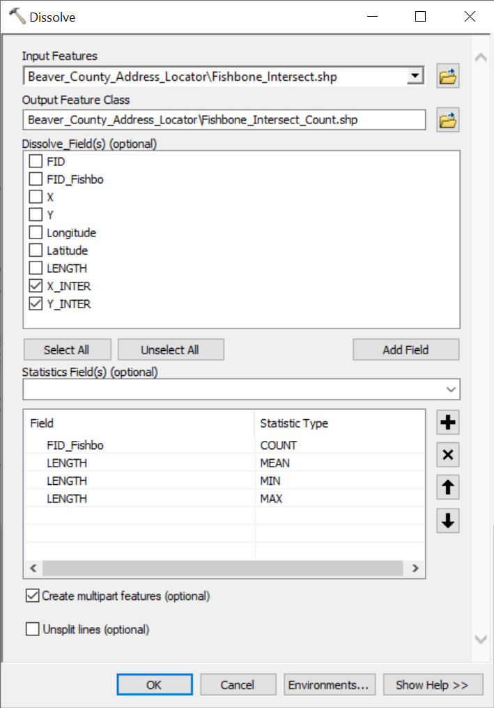

[**Oklahoma NG911 Toolkit**](../README.html) | [Adjustment](Adjustment.html) | [Comparison](Comparison.html) | [Enhancement](Enhancement.html) | [MSAG](MSAG.html) | [Okprep](Okprep.html) | [Submission](Submission.html) | [Validation](Validation.html)

**Supplementary Documentation** | [Examples](Examples.html) | [***Generate Fishbone Analysis Tool***](FishboneAddressVerification.html) | [Topology Rules](Topology.html) | [Change Log](../ChangeLog.html) | [Error Glossary](ErrorGlossary.html)

# Fishbone Analysis for Address Verification

##### Script By:
Emma Baker and Riley Baird, Oklahoma Department of Transportation

##### Last Revised:
June 15, 2022

##### Note:
The data used in this fishbone analysis is not available to the public and is limited to testing purposes only.

## Generate Fishbone Analysis Tool
The *Generate Fishbone Analysis Tool* is located in the [Enhancement](Enhancement.html) toolset and can be used to generate a "Dirty" Fishbone Analysis for Address Point Verification. The analysis is considered dirty, because the fishbone line shapefile is created without the user performing a quality check on the geocoded data. Ties and non-matches are simply removed from the analysis. This tool should be used as an aid to the QA/QC process and **not** as a complete quality check of the data.

### Usage

1. Open this tool and input the standard-compliant geodatabase and the folder for the Fishbone Analysis outputs.
2. Execute this tool.

**Note:** Running [Calculate FullName/FullAddr (Enhancement)] before performing a fishbone analysis may prevent errors during geocoding.

### Understanding the Outputs
There are several outputs in the Fishbone Analysis output folder. The queried address points are output to a shapefile called "Address_Points_With_LatLon.shp". This is an output of address points queried to excluded the Latitude and Longitudes of zero and null. The geocoded address points are output to "Geocode_Results.shp", and the matched address points are output to "Matched_Geocoded_Results.shp". The user can review the geocoded results using the "Review/Rematch Address" tool in the Geocoding Toolbar. The fishbone analysis line shapefile is output to "Fishbone_Results.shp". The lines are drawn between the queried input address points ("Address_Points_With_LatLon.shp") and the matched geocoded results ("Matched_Geocoded_Results.shp"). This gives the user a visualization of the difference between the placement of an address point and the corresponding location of the address along a road centerline. If the option "Check for Intersecting Fishbones" was selected, the tool will also generate "Fishbone_Intersect.shp" and "Fishbone_Intersect_Count.shp". The first will contain a point feature for every fishbone line that intersected another (and will contain overlapping features). The second will have only one point at each unique intersection location.

### Results

A good example of the line output for the Fishbone Analysis is provided above (Map A), and examples of **possible** errors in the Fishbone Analysis are also provided. Map B has the address points associated with lot numbers of the same road centerline, so all the fishbone analysis lines end at the same location along that road centerline. Map C has the fishbone analysis lines intersecting, which could indicate an error with the road centerline data. For more examples of possible errors, see [Interview with Summit Award Winner: Dr. Sabah Jabbouri, Fishbones for Address Verification](https://www.waurisa.org/resources/Documents/TheSummit/TheSummit_Issue36_2014_Autumn.pdf).

## Running a Fishbone Analysis without the Generate Fishbone Analysis Tool

## 1. Create the Address Locator
In ArcToolbox, expand *Geocoding Tools* and open [*Create Address Locator*](https://desktop.arcgis.com/en/arcmap/10.7/tools/geocoding-toolbox/create-address-locator.htm) Tool. This tool takes data from the Road Centerline feature class to generate an ArcGIS "Address Locator" made specifically for your data.

### Setting the Parameters

#### Address Locator Style
Unless known otherwise, this should generally be set to `US Address - Dual Ranges`.

#### Reference Data
The road centerline feature class should be selected as the reference data. Its "Role" should be `Primary Table`.

**Note:** Other selectable roles include `Alternate Name Table`, `Alternate City Name Table`, and `Alias Table`. Those options are beyond the scope of this document.

#### Field Map
This parameter should present as a table with two columns: "Field Name" on the left and "Alias Name" on the right. The "Field Name" column should be pre-populated. Some values in the "Alias Name" column *might* be pre-populated. The alias names correspond to field names in the road centerline feature class. Find the suggested values in the table below.

Note that the values under "Alias Name" in the below table are given assuming that the road centerline feature class conforms to the schema specified by the Oklahoma Standards. Consider using the [Road Field Map (Okprep)], [Check Template (Validation)], and [Check Roads (Validation)] tools as appropriate.

**The "Alias Name" values in the table below may not apply to data that is not standards-compliant.**

Pay particular attention to the Alias Name values in ***bold italics***, as they might pre-populate to the incorrect field.

| Field Name | Alias Name |
| - | - |
| Feature ID | ***NGUID_RDCL*** |
| *From Left | *Add_L_From* |
| *To Left | *Add_L_To* |
| *From Right | *Add_R_From* |
| *To Right | *Add_R_To* |
| Left Parity | *Parity_L* |
| Right Parity | *Parity_R* |
| Full Street Name | ***FullName*** |
| Prefix Direction | *PreDir* |
| Prefix Type | *PreType* |
| *Street Name | *Street* |
| Suffix Type | *StreetType* |
| Suffix Direction | *SufDir* |
| Left City or Place | *City_L* |
| Right City or Place | *City_R* |
| Left County | *County_L* |
| Right County | *County_R* |
| Left State | *State_L* |
| Right State | *State_R* |
| Left State Abbreviation | *&lt;None&gt;* |
| Right State Abbreviation | *&lt;None&gt;* |
| Left ZIP Code | *Zipcode_L* |
| Right ZIP Code | *Zipcode_R* |
| Country Code | *&lt;None&gt;* |
| 3-Digit Language Code | *&lt;None&gt;* |
| 2-Digit Language Code | *&lt;None&gt;* |
| Admin Language Code | *&lt;None&gt;* |
| Left Block ID | *&lt;None&gt;* |
| Right Block ID | *&lt;None&gt;* |
| Left Street ID | *&lt;None&gt;* |
| Right Street ID | *&lt;None&gt;* |
| Street Rank | *&lt;None&gt;* |
| Min X value for extent | *&lt;None&gt;* |
| Max X value for extent | *&lt;None&gt;* |
| Min Y value for extent | *&lt;None&gt;* |
| Max Y value for extent | *&lt;None&gt;* |
| Left Additional Field | *&lt;None&gt;* |
| Right Additional Field | *&lt;None&gt;* |
| Altname JoinID | *&lt;None&gt;* |
| City Altname JoinID | *&lt;None&gt;* |

#### Output Address Locator
It is recommended that the user create a new folder to the output of the Address Locator Tool as the output consist of multiple files. Do not output to a geodatabase.

## 2. Geocode Addresses
Geocode addresses with the Address Point feature class and the Address Locator file

### Procedure
Make sure the address point feature class and Address Locator file are added to your current ArcMap session. The user should make the *Geocoding Toolbar* available. Next, use the [*Geocode Addresses*](https://desktop.arcgis.com/en/arcmap/10.7/tools/geocoding-toolbox/geocode-addresses.htm) Tool in the Geocoding Toolset. The user will be prompted to add the Address Point feature class and the following inputs. The user can utilize the default options for geocoding.

`FullAddr` is in ***bold italics*** below, as it might pre-populate to the incorrect field. Be sure it is set correctly.

| Requested Field | User Input |
| - | - |
| Street or Intersection | ***FullAddr*** |
| City or Placename | *City* |
| State | *State* |
| ZIP Code | *Zipcode* |

For the output location, it is recommended the user save to the Address Point Locator folder and as a shapefile. The user can use the *Review/Rematch Addresses* on the *Geocoding Toolbar* to review through the geocoded results.

If many address points fail to match during geocoding, double-check your parameters, and consider running the [Calculate FullName/FullAddr (Enhancement)] tool.

## 3. Create the Fishbone Lines
Make sure the geocoded output is in your current ArcMap session. Next, use the [*XY to Line*](https://desktop.arcgis.com/en/arcmap/10.7/tools/data-management-toolbox/xy-to-line.htm) tool to create the final line feature class for the Address Point Fishbone Analysis.

### Procedure
Use the geocoded results as the input table and the output as a shapefile in the same Address Locator folder. The start X and Y are the Longitude and Latitude from the Address Points feature class, and the end X and Y fields are X and Y from the geocoded results. All of the X and Y variables should be inside the geocoded results already, so there is no need for recalculating geometries.

To calculate the lengths of the fishbone lines, the fishbone line feature class must be projected. Using the *Project* tool, project the fishbone line feature class to `NAD_1983_StatePlane_Oklahoma_North_FIPS_3501_Feet` or other appropriate **projected** coordinate system. Next, use the *Add Geometry Attributes* tool to add a field for and calculate the length of each line feature.

## 4. Fishbone Intersection Analysis
Locating points where fishbone lines intersect could alert the user to *potential* data issues.

### Procedure
First, use the *Intersect* tool with the projected fishbone line analysis output as the **only** input features. Set the output type to `POINT`. This will produce a point feature class of all of the locations where the fishbone line features intersect each other.

To get the number of unique intersection locations, create fields of type `DOUBLE` and use *Calculate Geometry* to populate them with X and Y coordinates. Then with the *Dissolve* tool, dissolve the intersection layer on the X and Y coordinate fields, and include the statistics fields as shown below. The number of features in the resulting feature class will be equal to the number of unique intersection locations. The `COUNT_FID_` field indicates the number of fishbone lines that intersected at each point. The `MEAN_LENGT`, `MIN_LENGTH`, and `MAX_LENGTH` fields indicate, in the units specified in the *Add Geometry Attributes* tool, the mean, minimum, and maximum lengths, respectively, of all of the fishbone lines that intersect at that point.

## Sources/References
[Interview with Summit Award Winner: Dr. Sabah Jabbouri, Fishbones for Address Verification](https://www.waurisa.org/resources/Documents/TheSummit/TheSummit_Issue36_2014_Autumn.pdf)

[Indiana NG9-1-1 GIS Data Model: Appendix D, Fishbone Analysis Summary](https://hancockcoingov.org/images/stories/surveyor/Indiana_NG9-1-1_draft101.pdf)

## Disclaimer

The Oklahoma NG9-1-1 GIS Toolbox is provided by the Oklahoma Geographic Information (GI) Council, Oklahoma 9-1-1 Management Authority, Oklahoma Department of Transportation (ODOT), Oklahoma Office of Geographic Information (OGI) , and associated contributors "as is" and any express or implied warranties, including, but not limited to, the implied warranties of merchantability and fitness for a particular purpose are disclaimed.  In no event shall the Oklahoma GI Council, Oklahoma 9-1-1 Management Authority, ODOT, OGI, or associated contributors be liable for any direct, indirect, incidental, special, exemplary, or consequential damages (including, but not limited to, procurement of substitute goods or services; loss of use, data, or profits; or business interruption) however caused and on any theory of liability, whether in contract, strict liability, or tort (including negligence or otherwise) arising in any way out of the use of this software, even if advised of the possibility of such damage.

[Road Field Map (Okprep)]: Okprep.html#2-road-field-map
[Check Template (Validation)]: Validation.html#1-check-template
[Check Roads (Validation)]: Validation.html#3-check-roads
[Calculate FullName/FullAddr (Enhancement)]: Enhancement.html#calculate-fullname-and-fulladdr
