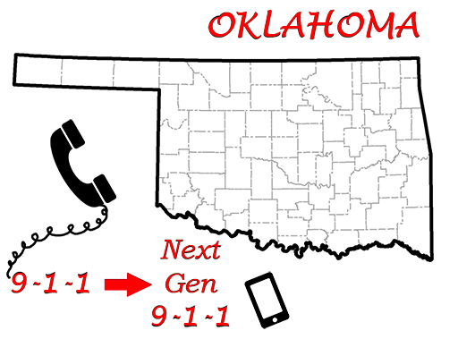
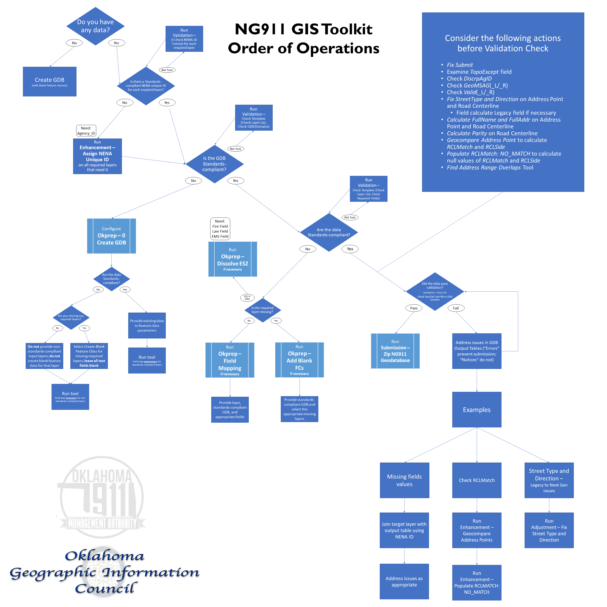

[**Oklahoma NG911 Toolkit**](README.html) | [Adjustment] | [Comparison] | [Enhancement] | [MSAG] | [Okprep] | [Submission] | [Validation]

**Supplementary Documentation** | [Examples](Doc/Examples.html) | [Generate Fishbone Analysis Tool](Doc/FishboneAddressVerification.html) | [Topology Rules](Doc/Topology.html) | [Change Log](ChangeLog.html) | [Error Glossary](Doc/ErrorGlossary.html)

# **Oklahoma Next-Generation 9-1-1 Toolkit**

## **Abstract**

Adapted from the [Kansas NG911 Toolkit], the Oklahoma Next-Generation 9-1-1 Toolkit is a collection of Toolsets modified to identify possible errors and assist the user in complying with the NG911 Oklahoma Standards. The Toolkit includes 7 toolsets: [Okprep], [Adjustment], [Comparison], [Enhancement], [MSAG], [Submission], and [Validation]. The Toolkit can be found on the [Oklahoma Geographic Information Council's website](https://okmaps.onenet.net/address_standards.htm).

## **Getting Started**
Unzip the NG911 Toolbox and leave all files and folders in the original structure. Maintaining this file and folder structure is required for proper operation of the Toolkit.

### **Requirements**

#### ArcGIS
This toolkit requires an installation of ArcGIS. These tools were tested in ArcGIS Desktop 10.7. They may or may not work as expected in other versions of ArcGIS.

#### Python
ArcGIS 10.7 is installed with Python 2.7. The tools may or may not work with other versions of Python. The `arcpy` package, included with ArcGIS, is required, as well as an active ArcGIS license. Standard license is required for Topology, and Advanced license is required for Check Road ESN Advanced. Otherwise, a Basic license is required.

#### Current Oklahoma NG911 Standards
See the [Oklahoma Geographic Information Council's standards webpage](https://okmaps.onenet.net/address_standards.htm) for the latest versions of the Oklahoma NG911 and Address Standard.

### **Using the Tools**

#### **Okprep Tools**

The [Okprep] tools provide the user with an easy way to create a new standards-compliant geodatabase and convert existing data to comply with the schemas set forth in the Oklahoma NG911 Standards. For more information on where to start as a user, see the [Examples] document.

##### Create Empty Geodatabase
To create an empty geodatabase, run the [0 Create GDB] with a folder location, an output GDB name, a selected coordinate reference system. Leave the feature layer fields blank and click 'Run'. The output geodatabase will be in the folder specified and will have a user-specified name. If the user checks the 'Create Blank *Layer Name* FC' options, the tool will create an Oklahoma standards-compliant blank feature class when a feature class is not provided **or** when the feature class provided does not match the Oklahoma standards.

##### Field Mapping
To create a feature class that is correctly formatted, use the Field Map Tools with the correctly-formatted geodatabase, the old feature class, and the user-defined fields mapping to the appropriate fields. **Triple-check** all user inputs before running the field mapping tool, especially similar fields like `Country` and `County`.

For more information on the individual tools in this toolset, see the [Okprep] Toolset Documentation.

#### **Validation Tools**
**IMPORTANT:** Keep all fields up-to-date, in particular `SUBMIT` and `TopoExcept`. Features where `SUBMIT` is `N` will be omitted entirely from validation checks. Features given a topological exception will be exempted from a given [topological rule](Doc/Topology.html).

The tools in the [Validation] toolset were written to review the NG911 geodatabase data for submission to the NG911 repository using the Oklahoma NG911 Standards. The local data steward is responsible for running the Oklahoma NG911 GIS data submissions through the Oklahoma NG911 Toolbox [Validation] toolset before data is submitted. To ensure compliance with the Oklahoma Standards, open the toolbox and toolset in ArcCatalog and run [8 Check All Required]. Each validation tool has a list of data checks to run, as well as some optional checks. All checks should be run on data at least once before submission. Some checks are separated into feature class type checks to allow the user to run a partial check on a second pass. However, the data in the geodatabase **must** pass [8 Check All Required] in order to be acceptable for submission.

For more information on the individual tools in this toolset, see the [Validation] Toolset Documentation.

##### Interpreting the Results
General notices, warnings, and errors during execution are printed to the console window. Results will be written to one of two tables added to the NG911 geodatabase: *TemplateCheckResults* and *FieldValuesCheckResults*. Several other tables and feature classes may get added to the geodatabase or the folder containing the geodatabase. All these additional files are not required for submission and can be deleted after review, **except** for a text file called `<Geodatabase_Name>.txt`, which should not be deleted. All data in *FieldValuesCheckResults* table will have a `FeatureID` recorded corresponding to the NENA unique ID field of a particular feature class (like `NGUID_RDCL` for *ROAD_CENTERLINE*). Users can look up errors in multiple ways. The recommended way is to bring both the relevant feature class and the *FieldValuesCheckResults* table into ArcMap and perform a join between the feature class's NENA unique ID field and the `FeatureID` field in *FieldValuesCheckResults*.

##### Checking Data After Edits
After editing any data, it is recommended that users rerun the Validation tools. To clear the results tables, use [6 Optional Clear Results Table].

#### **Adjustment Tools**
The [Adjustment] Tools can be used to fix minor errors and inconsistencies for certain fields in a given feature class.

##### Marking for Submission using Fix Submit
The Fix Submit tool will calculate blank/null values in the `SUBMIT` field to `Y` for all the feature classes in a geodatabase. The user would simply mark the features that are not to be included in the submission with `N` and run the Fix Submit tool.

##### Converting from Legacy to Next Generation using Fix Street Type and Direction
The Fix Street Type and Direction tool will recalculate the Street Type and Direction fields such as `StreetType`, `PreDir`, and `SufDir`. The user would provide the feature class and desired field name(s). It can also copy the pre-adjustment values of fields with corresponding legacy fields to those legacy fields.

For more information on the individual tools in this toolset, see the [Adjustment] Toolset Documentation.

#### **Comparison Tools**
The [Comparison] Tools can be used to look for differences between versions of NG911 feature classes or whole geodatabases.

For more information on the individual tools in this toolset, see the [Comparison] Toolset Documentation.

#### **Enhancement Tools**
The [Enhancement] Tools can be used to automate various tasks involved with data creation and perform quality checks to enhance the data.

##### Calculating FullName and FullAddr
The Calculate FullName and FullAddr tool calculates the `FullName` and/or `FullAddr` fields, as appropriate, for either an Address Point feature class or a Road Centerline feature class.

##### Generating Fishbone Analysis
The [Generate Fishbone Analysis] Tool generates a "Dirty" Fishbone Analysis for Address Point Verification. The analysis is considered dirty, because the fishbone line shapefile is created without the user performing a quality check on the geocoded data. Ties and non-matches are simply removed from the analysis. This tool should be used as an aid to the QA/QC process and not as a complete quality check of the data.

##### Calculating the Required Fields: RCLMatch and RCLSide
In order to calculate the required fields `RCLMatch` and `RCLSide` in the Address Point feature class, the user should begin with running the [Geocompare Address Points] tool. After that has completed, the user will then running [Populate RCLMatch NO_MATCH] to populate the missing/null values to `No Match` for `RCLMatch` and `U` for `RCLSide`.

For more information on the individual tools in this toolset, see the [Enhancement] Toolset Documentation.

#### **MSAG Tools**
The MSAG NG911 Comparison tool compares a Master Street Address Guide (MSAG) Excel File with their NG911 Road Centerline address ranges.

For more information on the individual tools in this toolset, see the [MSAG] Toolset Documentation.

#### **Submission Tools**
The data submission tools perform a variety of validation checks against the NG911 Data Model template to determine if the data is ready for submission.

##### Zip or Convert to Shaepfile
Within the [Submission] Tools, the user can either zip the geodatabase into a folder or convert the feature classes to shapefiles.  The user can also run a Check All Validation that will only zip the geodatabase if it passes the full validation check.

For more information on the individual tools in this toolset, see the [Submission] Toolset Documentation.

## **Credits**

### Original Codebase
Scripts written by Sherry Massey with Dickinson County, Kristen Jordan Koenig with DASC, and Kyle Gonterwitz and Dirk Talley with Kansas Department of Transportation

### Oklahoma Adaptation
Scripts written by Emma Baker and Riley Baird with the Oklahoma Department of Transportation (ODOT)

##### Last Revised:
June 15, 2022

## **Disclaimer**

The Oklahoma NG9-1-1 GIS Toolbox is provided by the Oklahoma Geographic Information (GI) Council, Oklahoma 9-1-1 Management Authority, Oklahoma Department of Transportation (ODOT), Oklahoma Office of Geographic Information (OGI) , and associated contributors "as is" and any express or implied warranties, including, but not limited to, the implied warranties of merchantability and fitness for a particular purpose are disclaimed.  In no event shall the Oklahoma GI Council, Oklahoma 9-1-1 Management Authority, ODOT, OGI, or associated contributors be liable for any direct, indirect, incidental, special, exemplary, or consequential damages (including, but not limited to, procurement of substitute goods or services; loss of use, data, or profits; or business interruption) however caused and on any theory of liability, whether in contract, strict liability, or tort (including negligence or otherwise) arising in any way out of the use of this software, even if advised of the possibility of such damage.

[Okprep]: Doc/Okprep.html
[Adjustment]: Doc/Adjustment.html
[Comparison]: Doc/Comparison.html
[Enhancement]: Doc/Enhancement.html
[MSAG]: Doc/MSAG.html
[Submission]: Doc/Submission.html
[Validation]: Doc/Validation.html
[Generate Fishbone Analysis]: Doc/FishboneAddressVerification.html
[0 Create GDB]: Doc/Okprep.html#0-create-gdb
[6 Optional Clear Results Table]: Doc/Validation.html#6-clear-results-table-optional-
[8 Check All Required]: Doc/Validation.html#8-check-all-required
[Geocompare Address Points]: Doc/Enhancement.html#geocompare-address-points
[Populate RCLMatch NO_MATCH]: Doc/Enhancement.html#populate-rclmatch-no_match
[Kansas NG911 Toolkit]: https://github.com/kansasgis/NG911
[Examples]: Doc/Examples.html
